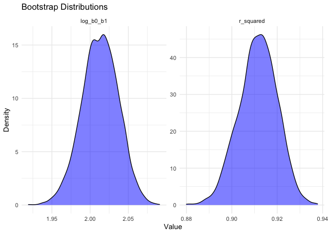
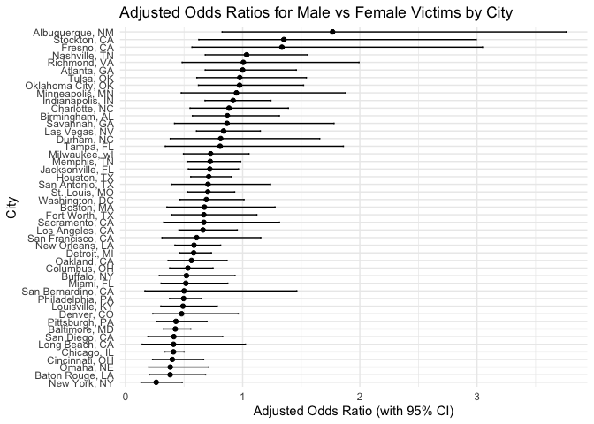
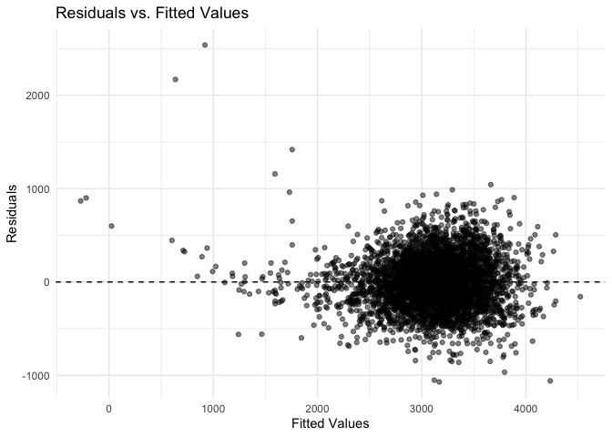
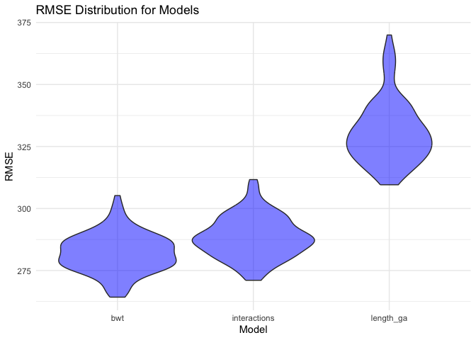

p8105_hw6
================
2024-12-02

## **Problem 1**

``` r
weather_df = 
  rnoaa::meteo_pull_monitors(
    c("USW00094728"),
    var = c("PRCP", "TMIN", "TMAX"), 
    date_min = "2017-01-01",
    date_max = "2017-12-31") %>%
  mutate(
    name = recode(id, USW00094728 = "CentralPark_NY"),
    tmin = tmin / 10,
    tmax = tmax / 10) %>%
  select(name, id, everything())
```

    ## using cached file: /Users/nasihahussain/Library/Caches/org.R-project.R/R/rnoaa/noaa_ghcnd/USW00094728.dly

    ## date created (size, mb): 2024-12-02 11:59:02.796106 (8.667)

    ## file min/max dates: 1869-01-01 / 2024-11-30

``` r
set.seed(123) 

bootstrap_results = 
  replicate(
  n = 5000, 
  expr = {
    boot_sample <- weather_df %>% sample_frac(replace = TRUE)
    model <- lm(tmax ~ tmin, data = boot_sample)
    glance_out <- glance(model)
    tidy_out <- tidy(model)
    
    r_squared <- glance_out$r.squared
    log_b0_b1 <- log(tidy_out$estimate[1] * tidy_out$estimate[2])
    
    c(r_squared = r_squared, log_b0_b1 = log_b0_b1)
  },
  simplify = FALSE
) %>%
  bind_rows()

percentiles =
  bootstrap_results %>%
  summarize(
    r_squared_low = quantile(r_squared, 0.025),
    r_squared_high = quantile(r_squared, 0.975),
    log_b0_b1_low = quantile(log_b0_b1, 0.025),
    log_b0_b1_high = quantile(log_b0_b1, 0.975)
  )

bootstrap_results %>%
  pivot_longer(cols = everything(), names_to = "metric", values_to = "value") %>%
  ggplot(aes(x = value)) +
  geom_density(fill = "blue", alpha = 0.5) +
  facet_wrap(~metric, scales = "free") +
  theme_minimal() +
  labs(title = "Bootstrap Distributions", x = "Value", y = "Density")
```

<!-- -->

## **Problem 2**

data import and cleaning

``` r
homicide_data =
  read_csv(file = "./homicide-data.csv")
```

    ## Rows: 52179 Columns: 12
    ## ── Column specification ────────────────────────────────────────────────────────
    ## Delimiter: ","
    ## chr (9): uid, victim_last, victim_first, victim_race, victim_age, victim_sex...
    ## dbl (3): reported_date, lat, lon
    ## 
    ## ℹ Use `spec()` to retrieve the full column specification for this data.
    ## ℹ Specify the column types or set `show_col_types = FALSE` to quiet this message.

``` r
homicide_cleaned =
  homicide_data %>%
  mutate(
    city_state = str_c(city, state, sep = ", "),
    solved = if_else(disposition == "Closed by arrest", 1, 0),
    victim_age = as.numeric(victim_age)
  ) %>%
  filter(
    !city_state %in% c("Dallas, TX", "Phoenix, AZ", "Kansas City, MO", "Tulsa, AL"),
    victim_race %in% c("White", "Black"),
    !is.na(victim_age)
  )
```

    ## Warning: There was 1 warning in `mutate()`.
    ## ℹ In argument: `victim_age = as.numeric(victim_age)`.
    ## Caused by warning:
    ## ! NAs introduced by coercion

logistic regression - baltimore

``` r
baltimore_data =
  homicide_cleaned %>%
  filter(city_state == "Baltimore, MD")

baltimore_model =
  glm(solved ~ victim_age + victim_race + victim_sex, data = baltimore_data, family = binomial()) 

broom::tidy(baltimore_model, exponentiate = TRUE, conf.int = TRUE) %>%
  filter(term == "victim_sexMale") %>% 
  select(estimate, conf.low, conf.high)
```

    ## # A tibble: 1 × 3
    ##   estimate conf.low conf.high
    ##      <dbl>    <dbl>     <dbl>
    ## 1    0.426    0.324     0.558

logistic regression - all cities

``` r
all_city_model =
  homicide_cleaned %>%
  nest(data = -city_state) %>%
  mutate(
    model = map(data, ~ glm(solved ~ victim_age + victim_sex + victim_race, data = ., family = binomial)),
    tidy_results = map(model, ~ tidy(., exponentiate = TRUE, conf.int = TRUE))
  ) %>%
  unnest(tidy_results) %>%
  filter(term == "victim_sexMale") %>%
  select(city_state, estimate, conf.low, conf.high)
```

    ## Warning: There were 44 warnings in `mutate()`.
    ## The first warning was:
    ## ℹ In argument: `tidy_results = map(model, ~tidy(., exponentiate = TRUE,
    ##   conf.int = TRUE))`.
    ## Caused by warning:
    ## ! glm.fit: fitted probabilities numerically 0 or 1 occurred
    ## ℹ Run `dplyr::last_dplyr_warnings()` to see the 43 remaining warnings.

``` r
all_city_model %>%
  arrange(estimate) %>%
  mutate(city_state = factor(city_state, levels = city_state)) %>%
  ggplot(aes(x = city_state, y = estimate)) +
  geom_point() +
  geom_errorbar(aes(ymin = conf.low, ymax = conf.high), width = 0.2) +
  coord_flip() +
  theme_minimal() +
  labs(
    title = "Adjusted Odds Ratios for Male vs Female Victims by City",
    x = "City",
    y = "Adjusted Odds Ratio (with 95% CI)"
  )
```

<!-- -->

## **Problem 3**

cleaning data and regression model

``` r
birthweight_data =
  read_csv(file = "./birthweight.csv")
```

    ## Rows: 4342 Columns: 20
    ## ── Column specification ────────────────────────────────────────────────────────
    ## Delimiter: ","
    ## dbl (20): babysex, bhead, blength, bwt, delwt, fincome, frace, gaweeks, malf...
    ## 
    ## ℹ Use `spec()` to retrieve the full column specification for this data.
    ## ℹ Specify the column types or set `show_col_types = FALSE` to quiet this message.

``` r
birthweight_clean =
  birthweight_data %>%
  mutate(
    babysex = factor(babysex, levels = c(1, 2), labels = c("Male", "Female")),
    malform = factor(malform, levels = c(0, 1), labels = c("Absent", "Present")),
    frace = factor(frace, levels = c(1, 2, 3, 4, 8, 9),
                   labels = c("White", "Black", "Asian", "Puerto Rican", "Other", "Unknown")),
    mrace = factor(mrace, levels = c(1, 2, 3, 4, 8),
                   labels = c("White", "Black", "Asian", "Puerto Rican", "Other"))
  ) %>%
  filter(!is.na(bwt))

fit_bwt =
  lm(bwt ~ gaweeks + blength + bhead + wtgain + smoken + ppbmi + momage + parity + malform,
  data = birthweight_clean
)

birthweight_clean =
  birthweight_clean %>%
  add_predictions(fit_bwt, var = "predicted_bwt") %>%
  add_residuals(fit_bwt, var = "residuals")
```

residual vs fitted plot

``` r
ggplot(birthweight_clean, aes(x = predicted_bwt, y = residuals)) +
  geom_point(alpha = 0.5) +
  geom_hline(yintercept = 0, linetype = "dashed") +
  theme_minimal() +
  labs(
    title = "Residuals vs. Fitted Values",
    x = "Fitted Values",
    y = "Residuals"
  )
```

<!-- -->

comparisons models

``` r
fit_length_ga = 
  lm( bwt ~ blength + gaweeks, data = birthweight_clean)

fit_interactions = 
  lm(bwt ~ bhead * blength * babysex, data = birthweight_clean)
```

cross-validation

``` r
set.seed(123)

cv_splits = crossv_mc(birthweight_clean, 100) %>%
  mutate(
    train = map(train, as_tibble),
    test = map(test, as_tibble)
  )

cv_splits = cv_splits %>%
  mutate(
    fit_bwt = map(train, ~ lm(bwt ~ gaweeks + blength + bhead + wtgain + smoken + ppbmi + momage + parity + malform, data = .)),
    fit_length_ga = map(train, ~ lm(bwt ~ blength + gaweeks, data = .)),
    fit_interactions = map(train, ~ lm(bwt ~ bhead * blength * babysex, data = .))
  )
```

``` r
cv_splits = 
  cv_splits %>%
  mutate(
    rmse_bwt = map2_dbl(fit_bwt, test, ~ rmse(.x, .y)),
    rmse_length_ga = map2_dbl(fit_length_ga, test, ~ rmse(.x, .y)),
    rmse_interactions = map2_dbl(fit_interactions, test, ~ rmse(.x, .y))
  )
```

    ## Warning: There was 1 warning in `mutate()`.
    ## ℹ In argument: `rmse_bwt = map2_dbl(fit_bwt, test, ~rmse(.x, .y))`.
    ## Caused by warning in `predict.lm()`:
    ## ! prediction from rank-deficient fit; attr(*, "non-estim") has doubtful cases

``` r
rmse_results = cv_splits %>%
  select(rmse_bwt, rmse_length_ga, rmse_interactions) %>%
  pivot_longer(
    cols = everything(),
    names_to = "model",
    values_to = "rmse",
    names_prefix = "rmse_"
  )

ggplot(rmse_results, aes(x = model, y = rmse)) +
  geom_violin(fill = "blue", alpha = 0.5) +
  theme_minimal() +
  labs(
    title = "RMSE Distribution for Models",
    x = "Model",
    y = "RMSE"
  )
```

<!-- -->

``` r
rmse_results %>%
  group_by(model) %>%
  summarize(
    mean_rmse = mean(rmse),
    median_rmse = median(rmse),
    sd_rmse = sd(rmse)
  )
```

    ## # A tibble: 3 × 4
    ##   model        mean_rmse median_rmse sd_rmse
    ##   <chr>            <dbl>       <dbl>   <dbl>
    ## 1 bwt               282.        282.    7.84
    ## 2 interactions      288.        288.    8.24
    ## 3 length_ga         331.        329.   12.6
